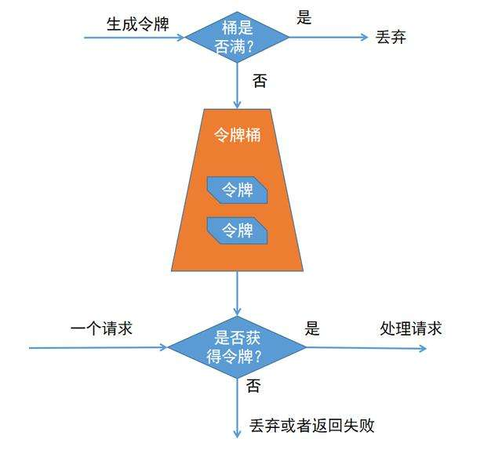
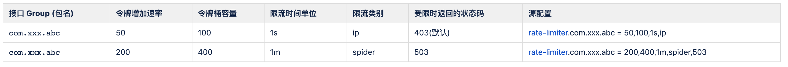

# 增强的限流功能

## 令牌桶算法 

> 令牌桶算法是Spring Cloud Gateway 采用的限流算法，Rate-limiter模块在此基础上进行了增强，要了解如何使用Rate-limiter模块，需要先对此算法有一个整体认识。



#### 令牌桶限流算法有四个核心的配置

* 多久补充一次令牌 （这个配置意味着限流的时间单位是什么，比如按秒、按分、按时）
* 一次补充多少个令牌 （这个配置意味着每个时间单位的最大请求次数）
* 令牌桶的大小 (这个配置意味着单位时间内允许的突发量是多少）
* 桶区分的KEY （这个配置意味着那些类型的流量会被放在一个桶类进行计算）

比如:按照下面 Spring-cloud-gateway 提供的RateLimiter模块配置,每一秒钟（默认值，不可能更改）向桶补充1000个令牌，桶最多可以装下2000个令牌，按照IP进行归类，同一IP放在一个桶类进行计算。
这个配置的意思是，增对单个IP的访问，最大的QPS是1000，瞬时并发最大为2000。

```
spring.cloud.gateway.routes[0].filters[1].args.key-resolver = #{@publicKeyResolver}
spring.cloud.gateway.routes[0].filters[1].args.redis-rate-limiter.replenishRate = 1000
spring.cloud.gateway.routes[0].filters[1].args.redis-rate-limiter.burstCapacity = 2000

@Bean
KeyResolver publicKeyResolver() {
    return (exchange) -> "exchange#ip";
}

```

## rate-limiter 功能增强

> Sping-cloud-gateway RateLimiter 模块有一定的局限性，比如不能修改补充令牌的时间，KEY的定义不灵活，这样对于一些复杂场景的限流就显得比较局促。因此rate-limiter限流扩展模块在此基础上扩展，增加了下面的功能。

### 1. 除了传统的秒为单位的令牌桶限流外，还提供了不同时间窗口限流实现

``` 
/**
 * 按秒限流
 */
ONE_SECOND("1s"),
/**
 * 按5秒限流
 */
FIVE_SECOND("5s"),
/**
 * 按10秒限流
 */
TEN_SECOND("10s"),
/**
 * 按30秒限流
 */
THIRTY_SECOND("30s"),
/**
 * 按分限流
 */
ONE_MINUTE("1m"),
 
/**
 * 按5分限流
 */
FIVE_MINUTE("5m"),
/**
 * 按10分限流
 */
TEN_MINUTE("10m"),
/**
 * 按30分限流
 */
THIRTY_MINUTE("30m"),
 
/**
 * 按时限流
 */
ONE_HOUR("1h");
```
### 2. 限流的KEY也提供了不同的组合方式

``` 
IP 基于IP的限流
IP_A 基于IP A段的限流
IP_B 基于IP B段的限流
IP_C 基于IP C段的限流
SPIDER 基于已声明爬虫的限流
```

### 3. 对于服务与接口限流的配置也更灵活

假如一个服务有下面两个接口

``` 
package com.izhengyin.springcloud.gateway.example.webagent.contollers;
public interface ApiController {
    @RequestMapping(method = {RequestMethod.GET,RequestMethod.HEAD},value = {"/hello/{name}","/hi/{name}"},name = "你好XXX")
    String hello(@PathVariable String name);
    @GetMapping(value = "/resource/{id}",name = "通过ID获取资源")
    String getResourceById(@PathVariable int id);
}

```

通过接口定义可以得到他们的处理请求的Method

``` 
com.izhengyin.springcloud.gateway.test.webagent.contollers.impl.ApiControllerImpl#hello(String)",
com.izhengyin.springcloud.gateway.test.webagent.contollers.impl.ApiControllerImpl#getResourceById(int)",

```

我们可以定义灵活的流控

``` 
rate-limiter.com.izhengyin.springcloud.gateway.test.webagent 对test-web-agent服务做流量控制
rate-limiter.com.izhengyin.springcloud.gateway.test.webagent.controller 对test-web-agent服务下的controller包下的接口做流量控制
rate-limiter.com.izhengyin.springcloud.gateway.test.webagent.contollers.impl.ApiControllerImpl#hello(String) 对test-web-agent服务下的controller模块下hello的接口做流量控制
```


### 配置示例




> 令牌增加速率 , 令牌桶容量 ，时间单位 ， 限流类别 , 受限时返回的状态码(默认403)
* 比如：rate-limiter.com.xxx.abc = 50,100,1s,ip 意思是单个IP对于com.xxx.abc下的接口每秒允许50次请求，空闲情况下，突发允许每秒100次请求
* 比如：rate-limiter.com.xxx.abc = 200,400,1m,spider,503 意思是标记为爬虫的Agent对于com.xxx.abc下的接口的访问每分允许200次请求，空闲情况下，突发允许每分400次请求，当触发限流时返回 503 的状态码

#### 组合限流配置

> 组合限流用 | 分隔，或的关系

``` 
rate-limiter.com.xxx.abc = 50,100,1s,ip  |  2000,4000,1m,ip_a 
```

